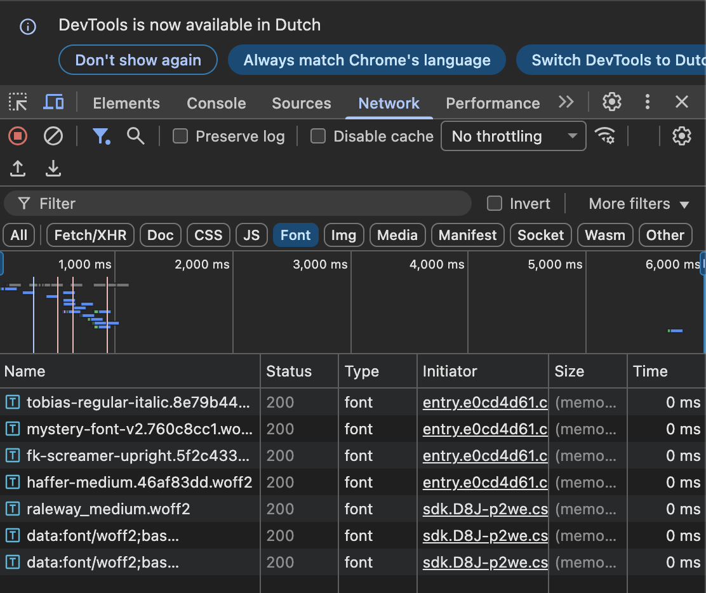
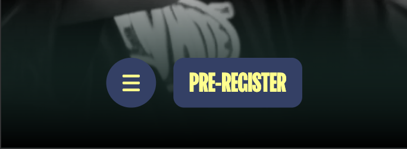

# Procesverslag
Markdown is een simpele manier om HTML te schrijven.  
Markdown cheat cheet: [Hulp bij het schrijven van Markdown](https://github.com/adam-p/markdown-here/wiki/Markdown-Cheatsheet).

Nb. De standaardstructuur en de spartaanse opmaak van de README.md zijn helemaal prima. Het gaat om de inhoud van je procesverslag. Besteedt de tijd voor pracht en praal aan je website.

Nb. Door *open* toe te voegen aan een *details* element kun je deze standaard open zetten. Fijn om dat steeds voor de relevante stuk(ken) te doen.

## Jij

  
uitwerken voor kick-off werkgroep

  ### Auteur:
  Ruben Verhoeven

  #### Je startniveau:
  Blauw

  #### Je focus:
  Surface plane
 

## Je website

  
uitwerken voor kick-off werkgroep

  ### Je opdracht:
  https://www.mysteryland.nl/

  #### Screenshot(s) van de eerste pagina (small screen): 
  Homepagina
  

  #### Screenshot(s) van de tweede pagina (small screen):
  FAQpagina
  
  
 

## Toegankelijkheidstest 1/2 (week 1)

  
uitwerken na test in 2e werkgroep

  ### Bevindingen
  Afbeeldingen hebben wel een ALT tekst, maar deze geeft geen goeie beschrijving van wat er op de afbeelding echt te zien is.
  Headings springen soms van H2 naar H4 dus niet semantisch correct

## Breakdownschets (week 1)

  
uitwerken na afloop 3e werkgroep

  ### de hele pagina: 
  
  

  ### dynamisch deel (bijv menu): 
  

  ### wellicht nog een dynamisch deel (bijv filter): 
  

## Voortgang 1 (week 2)

  
uitwerken voor 1e voortgang

  ### Stand van zaken
  Ik had de hele HTML van de homepagina af dit was goed gegaan, en had ik ook laten beoordelen door de studentassistenten tijden het feedback moment op vrijdag, en hier heb ik ook vragen gesteld hoe ik bepalde dingen kon gaan maken die op de faqpagina stonden, waarvan ik eigenlijk niet wist hoe ik het moest maken. Damian had me een lijstje gestuurd met de feedback en dingen die ik kon gebruiken voor de code. Hiermee kon ik goed verder gaan aan de opdracht. Ik heb goed geleerd hoe ik alle content van de echt website kon downloaden, en Damian had me geholpen de gedownlaode Fonts in een mapje te zetten en zo in mijn CSS te zetten, dit had ik namenlijk gevraagd tijdens het feedback moment hoe dat moest. 

  
  ### Agenda voor meeting
  samen met je groepje opstellen

  | student 1       | student 2          | student 3    | student 4        |
  | ---             | ---                | ---          | ---              |
  | Sturctuur HTML  | en dit             | en ik dit    | en dan ik dat    |
  | en              | dit als er tijd is | nog een punt | dit wil ik zeker |
  | Fonts koppelen  | ...                | ...          | ...              |

  ### Verslag van meeting
Feedback meeting;

De header was aanwezig, maar ik moest nog een <nav> element toevoegen zodat de browser begrijpt dat het om navigatie gaat.

Als ik de navigatiebalk wil laten meescrollen, kan ik position: fixed gebruiken in de CSS.

Let op dat ik geen hoofdletters gebruik bij HTML-elementen, dit mag niet volgens de standaard.

Mijn code was  netjes ingesprongen.

Ik kreeg de tip om Flexbox te gebruiken om onderdelen te positioneren in plaats van marging of veel 
s.

Ook werd uitgelegd hoe ik foto’s kan downloaden via de browser inspector (Network-tab en daarna refreshen).

Damian had alle bovenstaande feedback bijgehouden en via Teams met me gedeeld.

## Voortgang 2 (week 3)

  
uitwerken voor 2e voortgang

  ### Stand van zaken
  Ik heb beide pagina's beide helemaal af, ik heb hulp gekregen bij de animatie op de faqpagina maken, ik kwma hier eerst namenlijk niet uit. Ik heb feedback gekregen van de studentassistenten dat ik geen classes mocht gebruiken, dit wist ik ook maar ik ben eigenwijs geweest en heb eerst alles gemaakt met classes, omdat ik dit zo had geleerd in jaar 1 vond ik het voor toen even makkelijker omdat ik coderen al heel moeilijk vindt. Het probleem was alleen dat ik dacht de classes aan te passen naar sections en an te spreken met nth of typem, maar dit was moeilijker en duurde langer dan gedacht, hierdoor heb ik de deadline helaas niet gehaald voor de 1e kans. Vervolgens ben ik verder gegaan met alles naar sections te veranderen en dit ging aaridg goed! 

  ### Agenda voor meeting
  samen met je groepje opstellen

  | student 1      | student 2          | student 3    | student 4        |
  | ---            | ---                | ---          | ---              |
  | dit bespreken  | en dit             | en ik dit    | en dan ik dat    |
  | en dat ook nog | dit als er tijd is | nog een punt | dit wil ik zeker |
  | ...            | ...                | ...          | ...              |

  ### Verslag van meeting
  ik had helaas deze meeting gemist vanwege ziek zijn, maar ik heb vervolgens in de les daarop hulp gevraagd aan de studenasistenten. Ik had namenlijk een probleem dat mijn mysteryland logo niet meer zichtbaar was in het hamburger menu, en ik had echt alles geprobeerd met z-index en van alles maar niks hielp. Damian heeft me toen best lang geholpen omdat hij er ook niet uitkwam eerst, maar uiteindelijk bleek het te komen door een verkeerde structuur in de HTML. 

## Toegankelijkheidstest 2/2 (week 4)

  
uitwerken na test in 9e werkgroep

  ### Bevindingen
  Afbeeldingen
Ik heb bij elke foto een alt-tekst gezet. Zo kan een screenreader vertellen wat erop staat. Op de echte Mysteryland site doen ze dat bijna niet.

HTML-opbouw
Ik heb mijn site gemaakt met duidelijke stukjes zoals <header>, <main> en <footer>. Op de echte site gebruiken ze bijna alleen maar 
s, dat is lastiger voor mensen die een screenreader gebruiken.

Menu
Mijn menu zit netjes in een <nav> met een lijst (<ul>, <li>, <a>). Dat is hoe het eigenlijk hoort. Bij de echte site staan de menu-knoppen een beetje rommelig in de code.

Koppen (titels)
Mijn koppen lopen logisch: eerst <h1>, dan <h2> en dan <h3>. Op de echte site springen ze een beetje door elkaar, dat is niet zo handig.

Kleuren
Het contrast verschil tussen tekst en achtergrond is goed op mijn site. Op de echte Mysteryland site is dat ook prima, dus dat zit goed.

Video
Mijn achtergrond video kan op pauze dit kon bij mysteryland niet.

## Voortgang 3 (week 4)

  
uitwerken voor 3e voortgang

  ### Stand van zaken
 Uiteindelijk heb ik dinsdag de week voor de herkansing nog een keer Feedback gevraagd in de Medialounge aan Danny, omdat ik ergens niet uitkwam, wat er namenlijk gebeurde was dat er een specifieke code stond in mijn css voor elementen op de homepagina, maar deze code overschreef de code van mijn Faqpagina, waardoor ik er niet uitkwam waarom sommige dingen niet werkten, Danny heeft me goed geholpen door me te laten zien dat ik via inspecteren in de broswer goed kon kijken tussen alle CSS die voor dat stukje geld, en toen viel me inderdaad op dat er CSS stond die eigenlijk alleen voor mijn Homepagina moest zijn, hierdoor kon ik de faqpagina verbeteren en specifiekere code geven waardoor het niet werd overschreven. Ook kreeg ik feedback dat ik alle px moest veranderen naar em of rem, Ik had eerst alles omgerekend naar EM, maar toen stonden er sommige dingen heel groot op mijn pagina, ik vroeg aan ChatGPT hoe dit kon en hij zei: "Het probleem is dat em relatief is aan de parent element's font-size, terwijl  px absoluut is. Daarom werkt het niet goed als je zomaar alles omrekent. Het probleem:
  1em = de font-size van het parent element
  Als een parent font-size: 2em heeft, dan is 1em binnen dat element 32px (2 × 16px)
  Dit stapelt zich op, waardoor alles gigantisch of juist heel klein wordt

  Oplossingen:
  Optie 1: Gebruik rem in plaats van em
  rem (root em) is altijd relatief aan de root <html> font-size, dus geen stacking problemen:"
  Toen heb ik dus alles naar rem gedaan en het werkte perfect!

  ### Agenda voor meeting
  samen met je groepje opstellen

  | student 1      | student 2          | student 3    | student 4        |
  | ---            | ---                | ---          | ---              |
  | dit bespreken  | en dit             | en ik dit    | en dan ik dat    |
  | en dat ook nog | dit als er tijd is | nog een punt | dit wil ik zeker |
  | ...            | ...                | ...          | ...              |

  ### Verslag van meeting
  hier na afloop snel de uitkomsten van de meeting vastleggen

  - punt 1
  - punt 2
  - nog een punt
  - ...

## Eindgesprek (week 5)

  
uitwerken voor eindgesprek

  ### Je uitkomst - karakteristiek screenshots:
  

  ### Dit ging goed/Heb ik geleerd: 

  Ik heb goed geleerd dat je dus ook :nth of type kan gebruiken als selector dit wist ik eerst niet en eerst deed ik alles met classes & divs.
  
  
  Ik heb geleerd hoe ik SVG's van een website kan pakken en in mijn eigen code kan gebruiken.
  

  Ik heb geleerd dat je via inspecteren in een broswer alles van een site kunt downloaden en zo dus ook de fonts, dit ging eerst niet goed tot Damian de studentassistent me had geholpen.
  
  
  Wat ik ook heb geleerd en wat ook goed ging was dat ik via de inspector goed na kan kijken of er geen code is die de andere code overscrhijft op verschillende pagina's dit heeft me goed geholpen.

  ### Dit was lastig/Is niet gelukt:
  Wat me niet is gelukt is dat als ik in mijn hamburger menu op een anchor link druk waar nu een # in staat dat dan de kleur van mijn menu bar dus de hambruger knop en pre register knop zijn goeie kleur behoudt.
  

  Wat ik ook lastig vond, is dat door nth of type te gebruiken mijn CSS veel minder overzichtelijk is geworden dan als ik classes gebruik met duidelijke namen. Misschien dat u hier een goeie tip voor heeft tijdens het Eindgesprek?!

## Bronnenlijst

  
continu bijhouden terwijl je werkt

  Nb. Wees specifiek ('css-tricks' als bron is bijv. niet specifiek genoeg). 
  Nb. ChatGpT en andere AI horen er ook bij.
  Nb. Vermeld de bronnen ook in je code.

  1. https://www.w3schools.com/html/html_forms.asp (invoer formulieren)
  2. https://cssgradient.io/ (Background gradient & andere gradients)
  3. https://codepen.io/RRoberts/pen/ZBYaJr (Microanimatie Hamburger menu)
  4. https://chatgpt.com (Image Carrousel & Gradients aan de onder en bovenkant van de pagina en bij de  Header & scroll animatie & Font size slider)
  5. https://www.youtube.com/watch?v=KD1Yo8a_Qis (Infinity carrousel FAQpagina, Damian studentassistent had deze video met me gedeeld, en het heeft me echt goed geholpen)
  6. https://www.w3schools.com/howto/howto_js_collapsible.asp (Uitklapbare tekst FAQ pagina)

